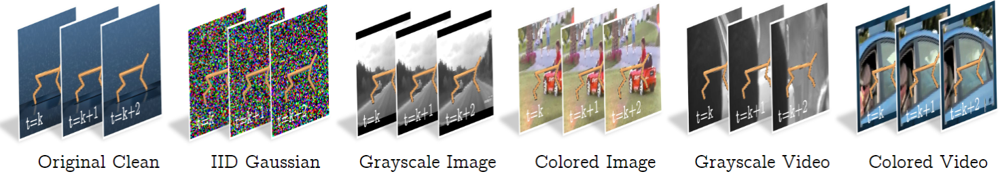

# Understanding Behavioral Metric Learning in Deep RL: A Large-Scale Study on Distracting Environments

📄 "Understanding Behavioral Metric Learning in Deep RL: A Large-Scale Study on Distracting Environments", RLC 2025
by [Ziyan "Ray" Luo](https://zyluo.netlify.app/), [Tianwei Ni](https://twni2016.github.io/), [Pierre-Luc Bacon](https://pierrelucbacon.com/), [Doina Precup](https://mila.quebec/en/directory/doina-precup), [Xujie Si](https://www.cs.toronto.edu/~six/)

<p align="center">
  
</p>

A modular framework that affords the comparison of *different behavioral metrics learning methods* in deep reinforcement learning.


## ⚙️ Installation
- Python (3.7.0 or higher recommended, and [Anaconda](https://www.anaconda.com/) recommended to set up a new environment)

- Install packages in `requirements.txt`: `pip install -r requirements.txt`

- Prepare Kinetics-400 dataset for natural images / video backgrounds (choose one of the two): 
    - (Recommended, for reproducing our result) Download the preprocessed dataset from [Google Drive](https://drive.google.com/file/d/1dkrB_2RWztCrEp_0A4UiEYtkqILgo5Hv/view?usp=sharing) and extract it to `environments/dmc2gym/res/`. The directory structure should look like:
        ```
        environments/dmc2gym/res/
            ├── train_video
            └── eval_video
        ```

    - (For better control of the dataset) Download the [Kinetics-400 dataset](https://github.com/Showmax/kinetics-downloader). Extract the videos under `driving_car` label from the train dataset to `environments/dmc2gym/res/train_video` and `environments/dmc2gym/res/eval_video`, or store in some other directory you want and set the `resource_files` and `eval_resource_files` in `cfgs/env/dmc_pixel.yaml` to the specific directory.

## 🚀 To run the minimal experiments

To run a minimal experiment (see **Hyperparameters** Section for details on configuring settings), you can use the following command:

### 🧪 State-based DMC (IID Gaussian Noise)
```
python main.py \
        env=dmc_state \
        domain_name=cheetah \
        task_name=run \
        agent.name=sac \
        seed=1 \
        noise_dim=32 \
        noise_std=8.0 \
        noise_source=noise \
        use_vectorized_training_env=true
```

### 🖼️ Pixel-based DMC (Natural Video Background)
```
python main.py \
        env=dmc_pixel \
        domain_name=cheetah \
        task_name=run \
        agent.name=sac \
        seed=1 \
        noise_source=video \
        use_vectorized_training_env=true
```

Default hyperparameters are stored in `cfgs/` directory.


## 🧠 Available Agents
See `cfgs/agent_configs.yaml` for the list of available agents. Pass `agent.name=<agent_name>` to the `main.py` script to use a specific agent.

## 📊 Hyperparameters
### Explanation of Hyperparameters
- Key hyperparameters to reproduce our results:
    - `env`: The environment to run the experiments (`dmc_pixel` or `dmc_state`).
    - `domain_name` and `task_name`: This pair defines the task name of the environment (See [DMC documentation](https://arxiv.org/abs/1801.00690) for available pairs).
    - `agent.name`: The agent to use for the experiments, defined in `cfgs/agent_configs.yaml`. Isolated metric evaluation agents are also included.
    - `action_repeat`: The number of times the action is repeated in DMC. Please set it for different tasks according to our paper, Appendix Sec. E to reproduce our result.
    - `seed`: The random seed for reproducibility.
    - `use_vectorized_training_env`: Whether to use vectorized training environments.
    - `noise_source`: The type of noise setting.
        - For state-based DMC, choose from `[noise, random_proj]`, which stands for IID Gaussian noise and IID Gaussian noise with random projection, respectively.
        - For pixel-based DMC, choose from `[none, images_gray, images, video_gray, video, noise]`, which stands for clean background, natural images background (grayscale and colored), natural video background (grayscale and colored), and IID Gaussian noise (per-pixel), respectively.
    - `noise_dim`: The dimension of the noise vector in state-based IID Gaussian noise (with / without random projection).
    - `noise_std`: The standard deviation of the noise in state-based IID Gaussian noise (with / without random projection).
    - `agent.encoder_post_processing`: In default, pixel-based settings use encoder with LayerNorm while state-based settings use an encoder without LayerNorm. Set to `no_layer_norm` for pixel-based environments, and `layer_norm` for state-based environments if you want to use the other setting.
- See `cfgs/env/*.yaml` for the detailed list of hyperparameters and their explanations.

### Priority of Different Sources of Hyperparameters
- The default *high-level hyperparameters* are stored in `cfgs/config.yaml`.
- The default *domain-specific hyperparameters* are stored in `cfgs/env/*.yaml`.
- The default *agent-specific hyperparameters* are stored in `cfgs/agent_configs.yaml`.
- The priority of hyperparameter overridings is as follows:
    1. Agent-specific hyperparameters defined in `cfgs/agent_configs.yaml`.
    2. Command line arguments. The command line arguments should be in the format of `key=value`. Note that these arguments do not override the agent-specific hyperparameters. If you want to DIY an agent, you should use one of the three base settings in `cfgs/agent_configs.yaml`.
    3. Domain-specific hyperparameters in `cfgs/env/*.yaml`.
    4. High-level hyperparameters specified by `cfgs/config.yaml`.

## 🗂️ Code Structure
- `main.py`: The entry to run the experiments.
- `agents/`: Contains the implementations of the agents, including encoders, decoders, and other models.
    - `base_agent.py`: The base class for the agents, providing vanilla [Soft Actor-Critic](https://github.com/haarnoja/sac) algorithm as the base agent for fair comparison.
    - `deepmdp_agent.py`: The DeepMDP agent ([reference implementation](https://github.com/facebookresearch/deep_bisim4control/blob/main/agent/deepmdp_agent.py)).
    - `bisim_agent_sac.py`: The [DBC](https://github.com/google-deepmind/dm_control) and [DBC-normed](https://github.com/metekemertas/RobustBisimulation) agents.
    - `mico_agent_sac.py`: The [MICo](https://github.com/google-research/google-research/blob/bb19948d367f3337c16176232e86069bf36b0bf5/mico) and [SimSR](https://github.com/bit1029public/SimSR) agents.
    - `rap_agent_sac.py`: The [RAP](https://github.com/jianda-chen/RAP_distance) agent.
    - `isolated_metric_agent.py`: The agent for isolated metric evaluation (Sec. 4.4 and Sec. 5.3 in our paper).
    - `distance_function.py`: The distance functions (d̂_R, d̂_T, and d_Ψ in Table 1) used in the agents.
    - `encoder.py`: The encoder used in the agents.
    - `transition_model.py`: The transition model used in the agents.
    - `model.py`: The actors and critics used in the agents.
- `cfgs/`: Contains the default hyperparameters for the experiments.
- `environments/`: Contains the environments and their wrappers (based on [dm_control](https://github.com/google-deepmind/dm_control)).
- `trainers/`: Contains the training and the evaluation loop for different domains.
- `utils/`: Contains utility functions.


## ❓ Questions and Issues
If you have any questions or issues, please feel free to email us (ziyan.luo@mail.mcgill.ca, twni2016@gmail.com), or open an issue on GitHub. We glad to hear any form of feedback, and will try our best to help you.


## 📚 References

- **DeepMind Control Suite (DMC)**  
  [📄 Paper](https://arxiv.org/abs/1801.00690) | [💻 Code](https://github.com/google-deepmind/dm_control)

- **Soft Actor-Critic + Autoencoder (SAC + AE)**  
  [📄 Paper](https://arxiv.org/abs/1910.01741) | [💻 Code](https://github.com/denisyarats/pytorch_sac_ae)

- **DeepMDP**  
  [📄 Paper](https://proceedings.mlr.press/v97/gelada19a.html)

- **Deep Bisimulation Control (DBC)**  
  [📄 Paper](https://arxiv.org/abs/2006.10742) | [💻 Code](https://github.com/facebookresearch/deep_bisim4control)

- **Matching under Independent Couplings (MICo)**  
  [📄 Paper](https://proceedings.neurips.cc/paper_files/paper/2021/hash/fd06b8ea02fe5b1c2496fe1700e9d16c-Abstract.html) | [💻 Code](https://github.com/google-research/google-research/blob/bb19948d367f3337c16176232e86069bf36b0bf5/mico)

- **DBC-normed**  
  [📄 Paper](https://arxiv.org/abs/2110.14096) | [💻 Code](https://github.com/metekemertas/RobustBisimulation)

- **Simple Distance-based State Representation (SimSR)**  
  [📄 Paper](https://arxiv.org/abs/2112.15303) | [💻 Code](https://github.com/bit1029public/SimSR)

- **Reducing Approximation Gap (RAP)**  
  [📄 Paper](https://proceedings.neurips.cc/paper_files/paper/2022/hash/eda9523faa5e7191aee1c2eaff669716-Abstract-Conference.html) | [💻 Code](https://github.com/jianda-chen/RAP_distance)


