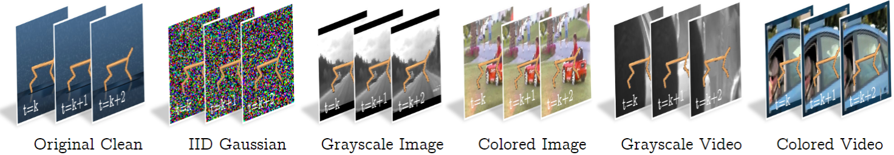

# Understanding Behavioral Metric Learning in Deep Reinforcement Learning

📄 ["Understanding Behavioral Metric Learning: A Large-Scale Study on Distracting Reinforcement Learning Environments"](https://arxiv.org/abs/2506.00563), [Reinforcement Learning Conference (RLC)](https://rl-conference.cc/) 2025

by [Ziyan "Ray" Luo](https://zyluo.netlify.app/)¹², [Tianwei Ni](https://twni2016.github.io/)¹³, [Pierre-Luc Bacon](https://pierrelucbacon.com/)¹³⁵, [Doina Precup](https://mila.quebec/en/directory/doina-precup)¹²⁵, [Xujie Si](https://www.cs.toronto.edu/~six/)¹⁴⁵

1. [Mila - Quebec Artificial Intelligence Institute](https://mila.quebec/), Montreal, Canada
2. [McGill University](https://www.mcgill.ca/), Montreal, Canada
3. [Université de Montréal](https://www.umontreal.ca/), Montréal, Canada
4. [University of Toronto](https://www.utoronto.ca/), Toronto, Canada
5. [Canada CIFAR AI Chair](https://www.cifar.ca/)


<p align="center">
  
</p>

A modular framework that affords the comparison of *different behavioral metrics learning methods* in deep reinforcement learning.


## ⚙️ Installation
- Python (3.7.0 or higher recommended, and [Anaconda](https://www.anaconda.com/) recommended to set up a new environment)

- Install packages in `requirements.txt`: `pip install -r requirements.txt`

- Prepare Kinetics-400 dataset for natural images / video backgrounds (choose one of the two): 
    - (Recommended, for reproducing our result) Download the preprocessed dataset from [Google Drive](https://drive.google.com/file/d/1dkrB_2RWztCrEp_0A4UiEYtkqILgo5Hv/view?usp=sharing) and extract it to `environments/dmc2gym/res/`. The directory structure should look like:
        ```
        environments/dmc2gym/res/
            ├── train_video
            └── eval_video
        ```

    - (For better control of the dataset) Download the [Kinetics-400 dataset](https://github.com/Showmax/kinetics-downloader). Extract the videos under `driving_car` label from the train dataset to `environments/dmc2gym/res/train_video` and `environments/dmc2gym/res/eval_video`, or store in some other directory you want and set the `resource_files` and `eval_resource_files` in `cfgs/env/dmc_pixel.yaml` to the specific directory.

## 🚀 To run the experiments

Please refer to the [`experiments/`](https://github.com/Rayluo-mila/understanding-metric-learning/tree/main/experiments) directory for the scripts that run the experiments in the paper. Detailed instructions are provided in the scripts.

To run minimal experiments (see Appendix F.1, **Hyperparameters** section for configuration details), use the following commands. Each script performs *ID and OOD generalization evaluations* concurrently.

### 🧪 State-based DMC (IID Gaussian Noise)

```bash
python main.py \
        env=dmc_state \
        domain_name=cheetah \
        task_name=run \
        agent.name=sac \
        seed=1 \
        noise_dim=32 \
        noise_std=8.0 \
        noise_source=noise \
        use_vectorized_training_env=true
```

### 🖼️ Pixel-based DMC (Natural Video Background)

```bash
python main.py \
        env=dmc_pixel \
        domain_name=cheetah \
        task_name=run \
        agent.name=sac \
        seed=1 \
        noise_source=video \
        use_vectorized_training_env=true
```

Default hyperparameters are stored in [`cfgs/`](https://github.com/Rayluo-mila/understanding-metric-learning/tree/main/cfgs) directory.


## 🧠 Available Agents

See [`cfgs/agent_configs.yaml`](https://github.com/Rayluo-mila/understanding-metric-learning/blob/main/cfgs/agent_configs.yaml) for the list of available agents. To specify an agent, pass `agent.name=<agent_name>` as a command-line argument to `main.py`, as done in the minimal experiments.

## 📊 Hyperparameters

See [`cfgs/README.md`](https://github.com/Rayluo-mila/understanding-metric-learning/blob/main/cfgs/README.md) for a detailed explanation of the key hyperparameters used in the experiments.

## 🗂️ Code Structure

- [`main.py`](https://github.com/Rayluo-mila/understanding-metric-learning/blob/main/main.py): Entry point for running experiments.

- [`agents/`](https://github.com/Rayluo-mila/understanding-metric-learning/tree/main/agents): Contains all agent implementations, including encoders, decoders, and other models.
    - [`base_agent.py`](https://github.com/Rayluo-mila/understanding-metric-learning/blob/main/agents/base_agent.py): The base class for the agents, providing vanilla [Soft Actor-Critic](https://github.com/haarnoja/sac) algorithm as the base agent for fair comparison.
    - [`deepmdp_agent.py`](https://github.com/Rayluo-mila/understanding-metric-learning/blob/main/agents/deepmdp_agent.py): The DeepMDP agent ([reference implementation](https://github.com/facebookresearch/deep_bisim4control/blob/main/agent/deepmdp_agent.py)).
    - [`bisim_agent_sac.py`](https://github.com/Rayluo-mila/understanding-metric-learning/blob/main/agents/bisim_agent_sac.py): The [DBC](https://github.com/google-deepmind/dm_control) and [DBC-normed](https://github.com/metekemertas/RobustBisimulation) agents.
    - [`mico_agent_sac.py`](https://github.com/Rayluo-mila/understanding-metric-learning/blob/main/agents/mico_agent_sac.py): The [MICo](https://github.com/google-research/google-research/blob/bb19948d367f3337c16176232e86069bf36b0bf5/mico) and [SimSR](https://github.com/bit1029public/SimSR) agents.
    - [`rap_agent_sac.py`](https://github.com/Rayluo-mila/understanding-metric-learning/blob/main/agents/rap_agent_sac.py): The [RAP](https://github.com/jianda-chen/RAP_distance) agent.
    - [`isolated_metric_agent.py`](https://github.com/Rayluo-mila/understanding-metric-learning/blob/main/agents/isolated_metric_agent.py): The agent for isolated metric evaluation (Sec. 4.4 and Sec. 5.3 in our paper).
    - [`distance_function.py`](https://github.com/Rayluo-mila/understanding-metric-learning/blob/main/agents/distance_function.py): The distance functions (d̂_R, d̂_T, and d_Ψ in Table 1) used in the agents.
    - [`encoder.py`](https://github.com/Rayluo-mila/understanding-metric-learning/blob/main/agents/encoder.py): Encoder architecture used by all agents.
    - [`transition_model.py`](https://github.com/Rayluo-mila/understanding-metric-learning/blob/main/agents/transition_model.py): Probabilistic transition models used for modeling dynamics.
    - [`model.py`](https://github.com/Rayluo-mila/understanding-metric-learning/blob/main/agents/model.py): Actor and critic network implementations.

- [`cfgs/`](https://github.com/Rayluo-mila/understanding-metric-learning/tree/main/cfgs): Default hyperparameter configurations.

- [`environments/`](https://github.com/Rayluo-mila/understanding-metric-learning/tree/main/environments): Environment interfaces and wrappers built on [dm_control](https://github.com/google-deepmind/dm_control).

- [`trainers/`](https://github.com/Rayluo-mila/understanding-metric-learning/tree/main/trainers): Training and evaluation loops for different environments.

- [`utils/`](https://github.com/Rayluo-mila/understanding-metric-learning/tree/main/utils): Utility functions (e.g., logging, seeding, and replay buffers).


## 🔧 Steps to DIY your own (metric-based) RL agents

- Create a new agent by inheriting from the `BaseAgent` class in [`agents/base_agent.py`](https://github.com/Rayluo-mila/understanding-metric-learning/blob/main/agents/base_agent.py). You can refer to the existing agents for examples.

- Defining the distance functions in the [`distance_function.py`](https://github.com/Rayluo-mila/understanding-metric-learning/blob/main/agents/distance_function.py) file.

- Add an entry in the [`cfgs/agent_configs.yaml`](https://github.com/Rayluo-mila/understanding-metric-learning/blob/main/cfgs/agent_configs.yaml) file.

- Run the experiment with the new agent by passing the agent name to the [`main.py`](https://github.com/Rayluo-mila/understanding-metric-learning/blob/main/main.py) script.

- If you want to customize the environment, you can put your own environment in the [`environments/`](https://github.com/Rayluo-mila/understanding-metric-learning/tree/main/environments) directory. Then, add a new trainer (for training and evaluation) for your environment in [`trainers/`](https://github.com/Rayluo-mila/understanding-metric-learning/tree/main/trainers) (see [`trainers/dmc_pixel.py`](https://github.com/Rayluo-mila/understanding-metric-learning/blob/main/trainers/dmc_pixel.py) for an example). Last, add a new entry in [`main.py`](https://github.com/Rayluo-mila/understanding-metric-learning/blob/main/main.py) and pass your environment's name to the `main.py` script to run the experiment.


## ❓ Questions and Issues
If you have any questions or issues, please feel free to email us (ziyan.luo@mail.mcgill.ca, twni2016@gmail.com), or open an issue on GitHub. We are glad to hear any form of feedback, and will try our best to help you.


## 📚 References

- **DeepMind Control Suite (DMC)**  
  [📄 Paper](https://arxiv.org/abs/1801.00690) | [💻 Code](https://github.com/google-deepmind/dm_control)

- **Soft Actor-Critic + Autoencoder (SAC + AE)**  
  [📄 Paper](https://arxiv.org/abs/1910.01741) | [💻 Code](https://github.com/denisyarats/pytorch_sac_ae)

- **DeepMDP**  
  [📄 Paper](https://proceedings.mlr.press/v97/gelada19a.html) | [💻 Code (provided by DBC authors)](https://github.com/facebookresearch/deep_bisim4control/blob/main/agent/deepmdp_agent.py)

- **Deep Bisimulation Control (DBC)**  
  [📄 Paper](https://arxiv.org/abs/2006.10742) | [💻 Code](https://github.com/facebookresearch/deep_bisim4control)

- **DBC with max normalization (DBC-normed)**  
  [📄 Paper](https://arxiv.org/abs/2110.14096) | [💻 Code](https://github.com/metekemertas/RobustBisimulation)

- **Matching under Independent Couplings (MICo)**  
  [📄 Paper](https://proceedings.neurips.cc/paper_files/paper/2021/hash/fd06b8ea02fe5b1c2496fe1700e9d16c-Abstract.html) | [💻 Code](https://github.com/google-research/google-research/blob/bb19948d367f3337c16176232e86069bf36b0bf5/mico)

- **Reducing Approximation Gap (RAP)**  
  [📄 Paper](https://proceedings.neurips.cc/paper_files/paper/2022/hash/eda9523faa5e7191aee1c2eaff669716-Abstract-Conference.html) | [💻 Code](https://github.com/jianda-chen/RAP_distance)

- **Simple Distance-based State Representation (SimSR)**  
  [📄 Paper](https://arxiv.org/abs/2112.15303) | [💻 Code](https://github.com/bit1029public/SimSR)


